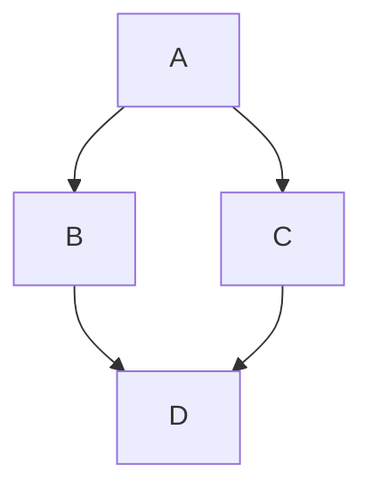

# Documentation Features

Page last revised on: {{ git_revision_date }}

```
Requirements:

mkdocs
mkdocs-material
plantuml-markdown
pymdown-extensions
pygments
mkdocs-pdf-export-plugin
fontawesome_markdown
mkdocs-git-revision-date-plugin

```

??? multiple optional-class "Summary"
    Here's some content.
    [=25%]{: .thin}

!!! note
    Lorem ipsum dolor sit amet, consectetur adipiscing elit. Nulla et euismod
    nulla. Curabitur feugiat, tortor non consequat finibus, justo purus auctor
    massa, nec semper lorem quam in massa.


:smile: :heart: :thumbsup:

## Mermaid Charts


 

## Sequence Diagrams
```sequence
Title: Here is a title
A->B: Normal line
B-->C: Dashed line
C->>D: Open arrow
D-->>A: Dashed open arrow
```

## Flowchart.js
```flow

st=>start: Start|past:>http://www.google.com[blank]
e=>end: End|future:>http://www.google.com
op1=>operation: My Operation|past
op2=>operation: Stuff|current
sub1=>subroutine: My Subroutine|invalid
cond=>condition: Yes
or No?|approved:>http://www.google.com
c2=>condition: Good idea|rejected
io=>inputoutput: catch something...|future

st->op1(right)->cond
cond(yes, right)->c2
cond(no)->sub1(left)->op1
c2(yes)->io->e
c2(no)->op2->e
```