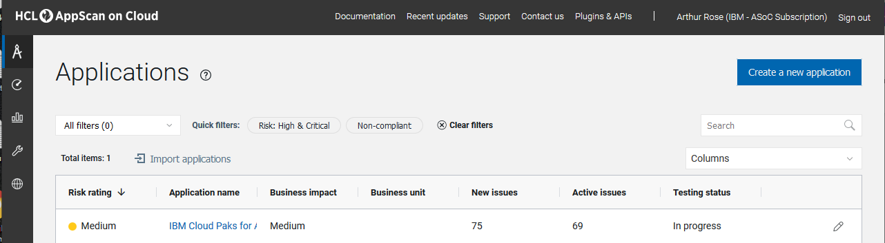
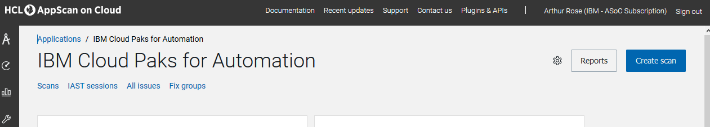
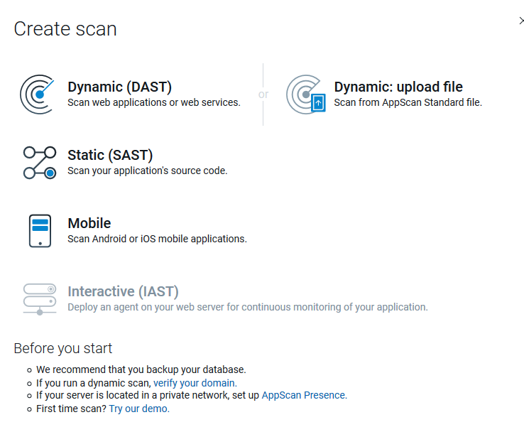
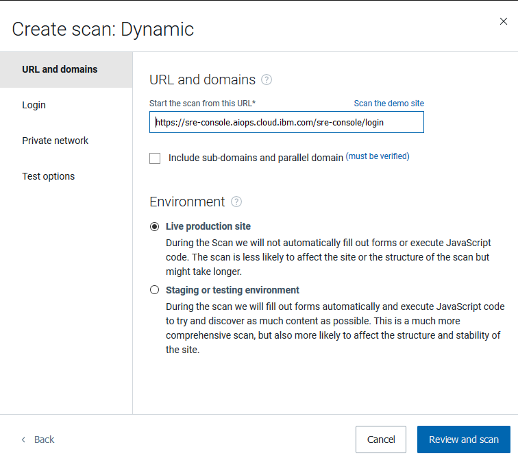
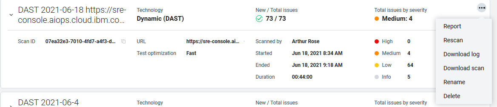

**AppScan**

Dustin was able to get us a subscription account setup for AppScan. The contact he used is Shruthi Thota, Shruthi.Thota@ibm.com

After that was created, we can login to the default landing page for us:
https://cloud.appscan.com/main/myapps

So far from what I can gather, we can get a scan on a cluster by clicking on the ‘IBM Cloud Paks for Automation’ link on that page, then ‘Scans’ on the next.

Then you choose the ‘Create scan’ button on the top right.

Choose the ‘Dynamic (DAST)’ scan option then add the URL to your cluster and click ‘Review and Scan’.
The URL I used was for Ralph’s new test cluster, https://sre-console.aiops.cloud.ibm.com/sre-console/login

After the scan, you can go back to the ‘Scans’ tab and view details about it’s status. Once finished, you can click the 3 dots on the host line and view or download the report.

https://github.ibm.com/APaaS/playbooks/blob/main/docs/AppScan/images/Report_DAST%202021-06-18%20https_sre-console.aiops.cloud.ibm.com_sre-console_clusters_clusterFilter%3Dc34vuh5w0op1v870vnqg_2021-06-24.pdf