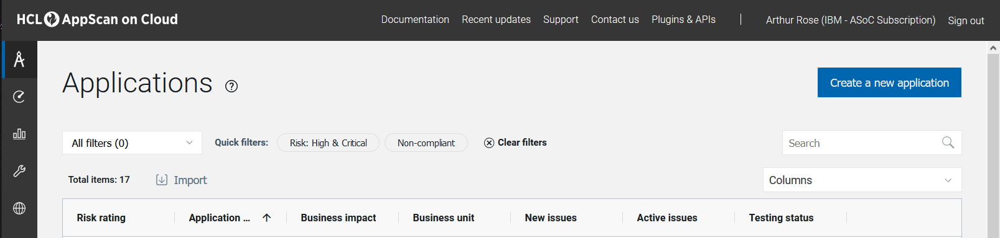
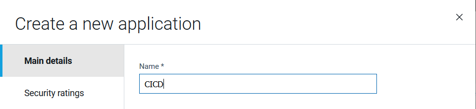
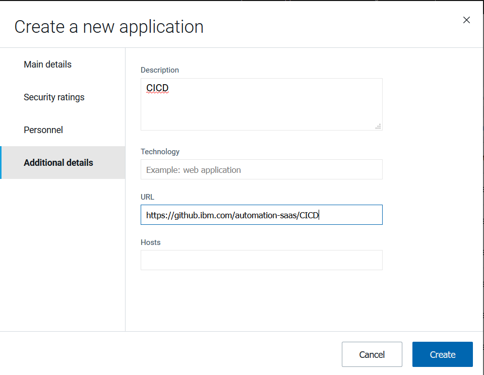

# Running an AppScan SAST Scan on IBM Cloud Paks for Automation
## Requirements:
1. AppScan Key ID and AppScan Key Secret.  Get/generate from here: https://cloud.appscan.com/main/settings
2. Application name in AppScan (ASOC) console ( https://cloud.appscan.com/main/myapps ).  Needs to correspond with the git repos.  Do not use spaces in the name, as that causes issues.
3. Github account and access token if doing a git clone of repo.

To setup an Application name, go to https://cloud.appscan.com/main/myapps
Click on 'Create a new application'


Under 'Main details' for 'Name' put the repo name.  Make sure not to use spaces.

Leave the rest of that tab with the defaults.

Under the 'Additional details' tab, for 'Description' put the repo name again.
Then put the URL to the repo under 'URL'.  Then click Create



After that, you can run a script on your local *nix host to start the SAST scan.
Thanks given to Pietro Dell'Amore for the base script.
###### Base Script
```console

    #!/bin/bash -e
    wget https://cloud.appscan.com/api/SCX/StaticAnalyzer/SAClientUtil\?os\=linux -O appscan.zip
    unzip appscan.zip && sudo mv SAClientUtil.8.0.1436 /opt/appscan
    export PATH="$PATH:/opt/appscan/bin"
    appscan.sh api_login -P $ASOC_SECRET -u $ASOC_KEY -persist
    appId=`appscan.sh list_apps | grep ${REPO_NAME} | cut -d " " -f3`
    appscan.sh prepare -n scan.irx -s deep
    appscan.sh queue_analysis -a $appId -nen -n "${REPO_NAME}-deep"
    rm scan.irx scan_logs.zip

```


###### Base Script v2
```console

    #!/bin/bash -e
    wget https://cloud.appscan.com/api/SCX/StaticAnalyzer/SAClientUtil\?os\=linux -
    O appscan.zip
    unzip appscan.zip && sudo mv SAClientUtil.8.0.1448 /opt/appscan
    export PATH="$PATH:/opt/appscan/bin"
    #git clone process
    rm -rf /root/CICD
    git clone https://github.ibm.com/automation-saas/testpak-service-broker.git
    cd /root/CICD
    pwd
    echo $$
    appscan.sh api_login -P $ASOC_SECRET -u $ASOC_KEY -persist
    appId=`appscan.sh list_apps | grep ${REPO_NAME} | cut -d " " -f3`
    appscan.sh prepare -n scan.irx -s deep
    appscan.sh queue_analysis -a $appId -nen -n "${REPO_NAME}-deep"
    rm scan.irx scan_logs.zip
    
    Modify the ~/.bash_profile to add variables for ASOC_SECRET, ASOC_KEY, and REPO_NAME, ie.
    export ASOC_SECRET=<value>
    export ASOC_KEY=<value>
    export REPO_NAME="CICD"
    Then run - source .bash_profile (assuming you are in correct home directory)
```


Then just run the script which will take a few minutes.  At the end, you will get a message about IRX file generation, then 100% transferred.
You can then go to the Application name in the ASOC dashboard. It will show either Queued or Running.  I've seen jobs queue for up to 2 hours before running.
When it finishes running you can download the report rom there.
