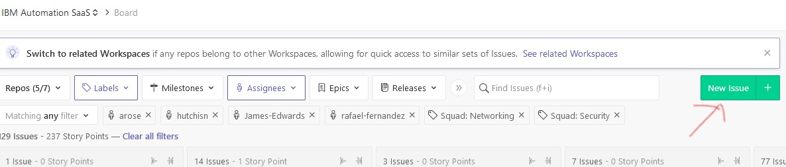
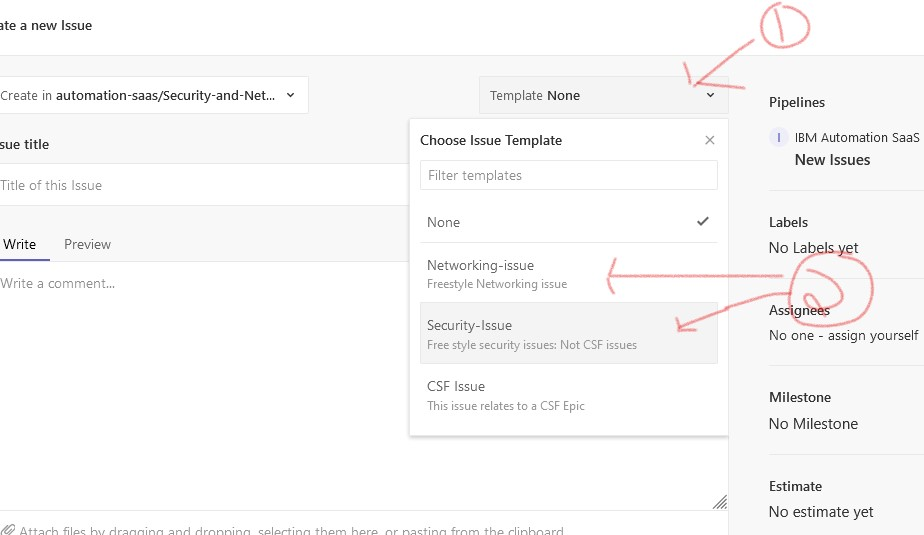
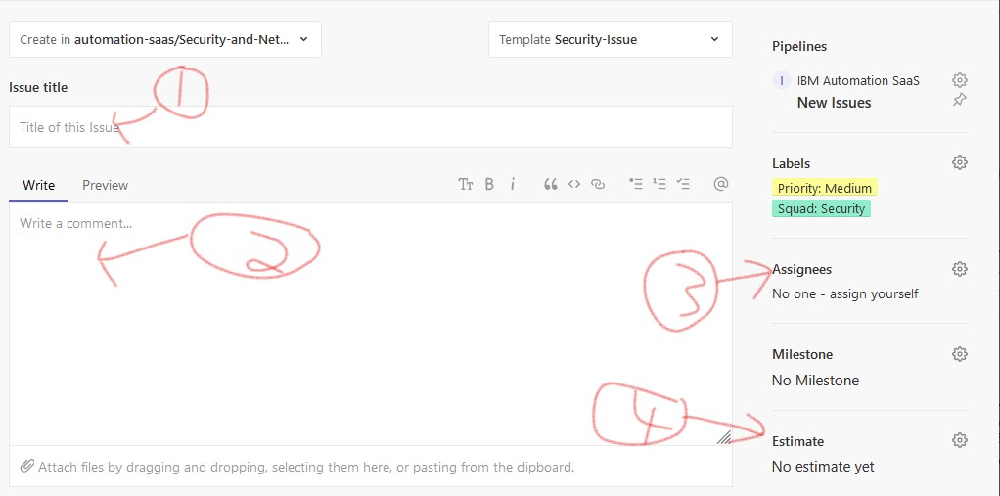

# Github Ticket Creation for Security and Network Team

*************************************************************************************
## 00 Guide to using Zenhub and Security / Network GHE template

*************************************************************************************

## 01 Utlize Zenhub test

Zenhub allows easy manipulation of tickets 

1) Install zenhub  https://w3.ibm.com/help/#/article/zenhub/install
2) Here is the link I use to see all of our issues 
https://zenhub.ibm.com/app/workspaces/ibm-automation-saas-6019733de38f226b805b1232/board?labels=squad%3A%20security,squad%3A%20networking&assignees=hutchisn,rafael-fernandez,arose,james-edwards&filterLogic=any&useDefaultFilterLogic=false&repos=1002832,1003069,1011804,1022919,1046426

## 01 Utlize templates 
a) Open a new issue in GHE

b) Select Security or Network template
  1) Select Template
  2) Select Network or Security Issue

c) Fill in the details
  1) Title of issue
  2) Details of issue
  3) Assign ticket to yourself (and others if applicable)
  4) Give an estimate for duration  
     - 1 story point = 8 hours (there are no half points)

