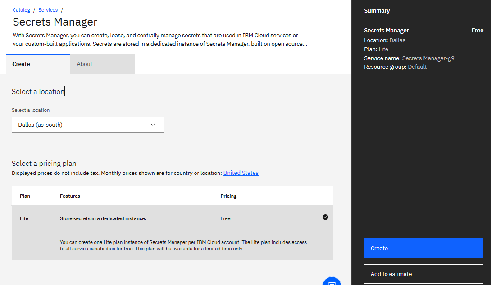
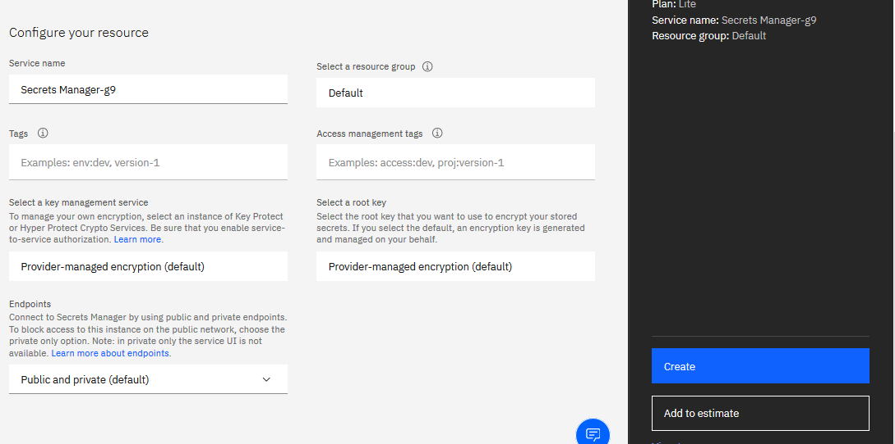
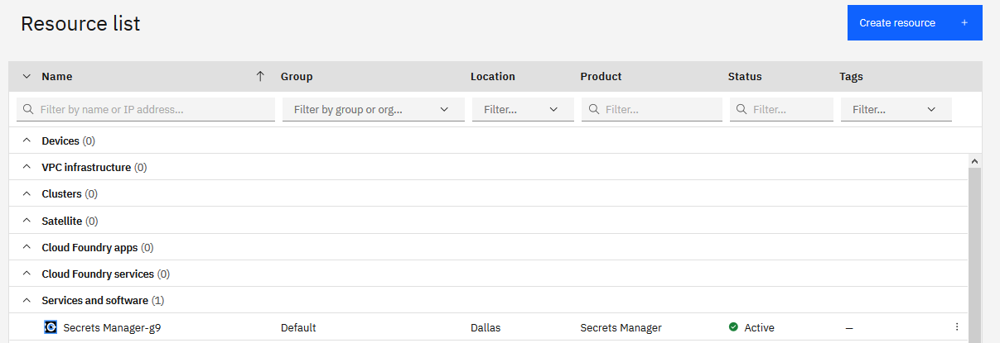
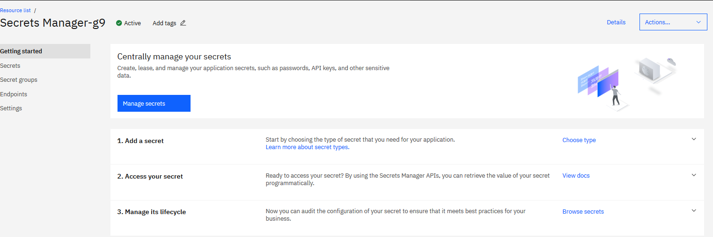
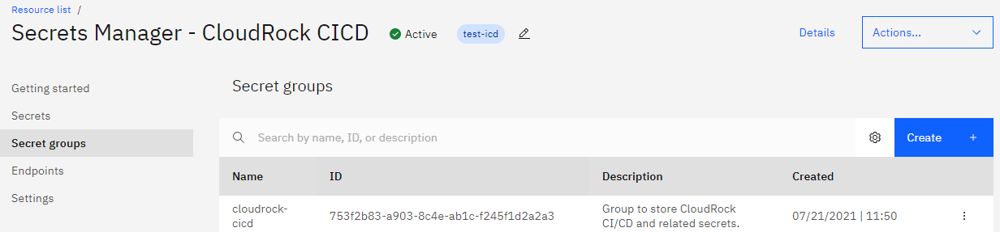
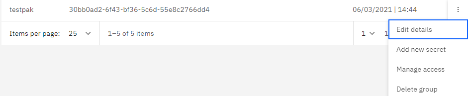
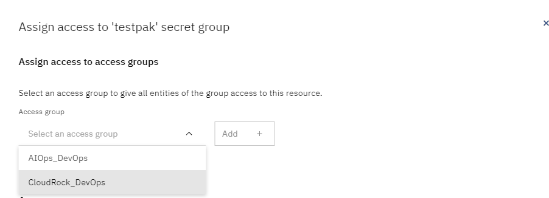
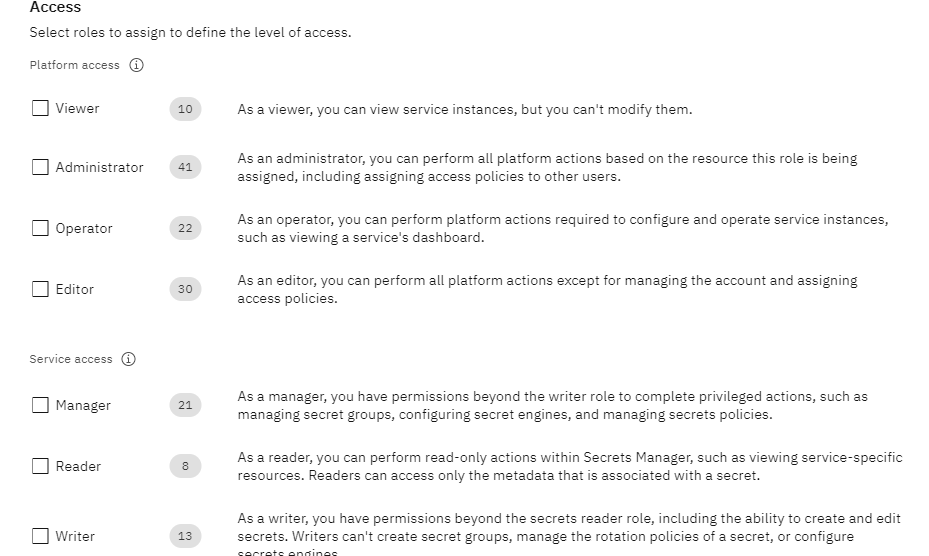

# IBM Secrets Manager

## Basic Setup:
The following was to setup in my own IBM Cloud account.  There already exists a Secrets Manager setup for the CloudRock DevOps account.  Examining still how to create for CloudRock Staging account, if that is needed.

The first thing needed is to create a Secrets Manager service instance in your IBM Cloud account.  You will want the ‘Manager service’ role or higher.
Login to your IBM Cloud account, then go to the Secrets Manager offering details page at https://cloud.ibm.com/catalog/services/secrets-manager
I chose the ‘Lite’ plan, which is listed as free and I chose Dallas as location, as this is just my own.  The rest I left defaults, then clicked Create.

Once ready, you will see it in your Resource List:

You can now click the Secrets Manager entry.  You have list of options to go from there:

Setup and Using Groups:
Click on the Secret Groups link on the left, and then Create:

Name the group and give a description.  After it creates, you will see it and can click on the 3 dots on the right, and can manage the group:

Manage access give you these options for multiple groups and permissions.  This should allow members of those groups access to the group:

