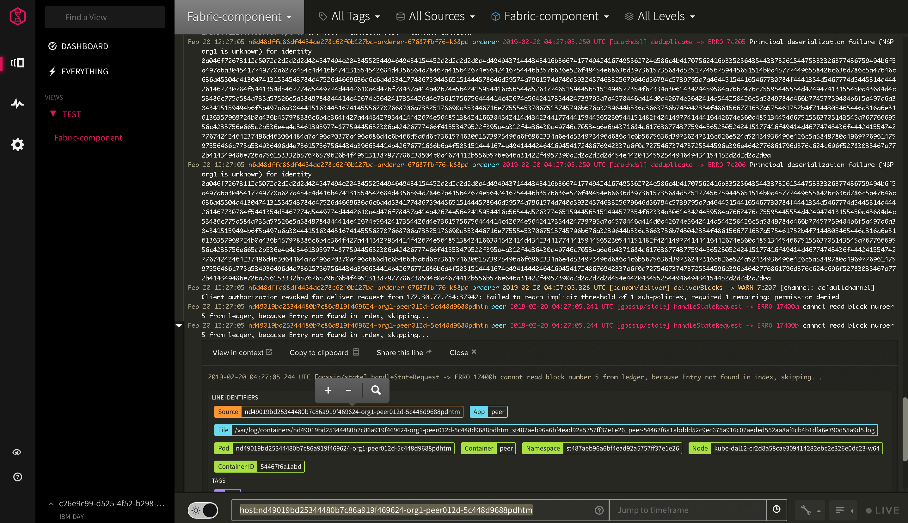
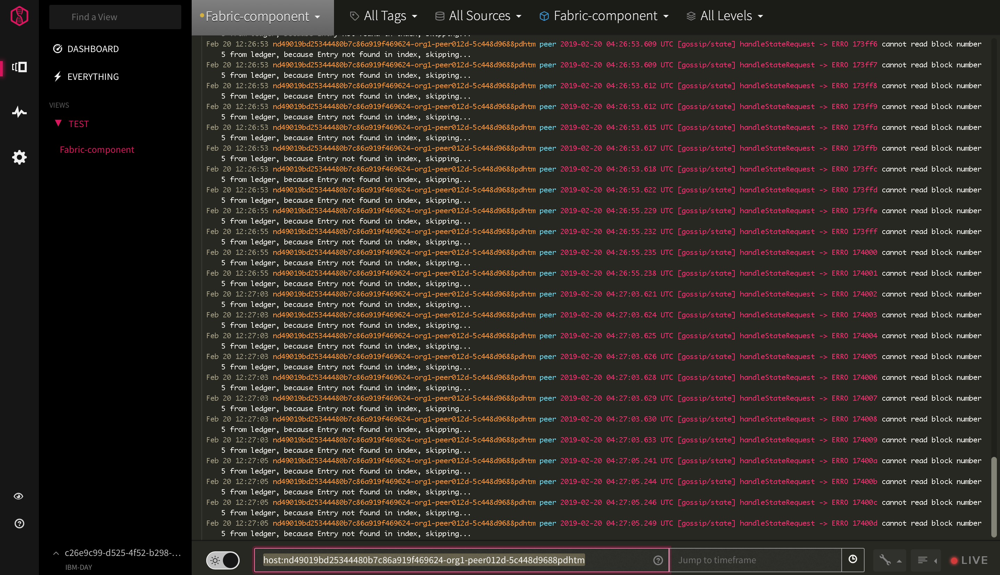

# logDNA 
https://github.ibm.com/IBM-Blockchain/operations/blob/main/runbooks/2.0/operational-tasks/logdna-setup.md#ArchivelogfilestoCOS

This is a note for how to setup LogDNA for Kubernetes cluster. For more information, see How to Manage Kubernetes cluster logs with IBM Log Analysis with LogDNA in IBM Cloud docs(https://console.bluemix.net/docs/services/Log-Analysis-with-LogDNA/tutorials/kube.html#kube).

* 1. [Provision LogDNA service](#ProvisionLogDNAservice)
* 2. [Add LogDNA instance to Kubernetes cluster](#AddLogDNAinstancetoKubernetescluster)
* 3. [Delete LogDNA instance](#DeleteLogDNAinstance)
* 4. [Feature for a paid plan](#Featureforapaidplan)
    * 4.1. [Filter logs](#Filterlogs)
    * 4.2. [Search logs](#Searchlogs)
    * 4.3. [Create view and setup alert](#Createviewandsetupalert)
    * 4.4. [Graph logs](#Graphlogs)
    * 4.5. [Export log line](#Exportlogline)
    * 4.6. [Archive log files to COS](#ArchivelogfilestoCOS)
    * 4.7. [ Customize Log Parser](#CustomizeLogParser)
    * 4.8. [ Search for one network](#Searchforonenetwork)
    * 4.9. [ Enabld super-tenancy](#Enabldsuper-tenancy)

##  1. Provision LogDNA service
Log in to the IBM Cloud account.

Catalog > Developer Tools category > IBM Log Analysis with LogDNA > Create instance

When the service is provisioned, you can navigation to Web UI.

Observability > Logging > View LogDNA

LogDNA ingestion key is available from the main panel for the LogDNA service instance.

##  2. Add LogDNA instance to Kubernetes cluster
`ibmcloud login -a api.ng.bluemix.net -sso`

`ibmcloud ks clusters`

`ibmcloud ks cluster-config <cluster_name_or_ID>`

`export KUBECONFIG=/path/to/kubeconfig/file`

`kubectl create secret generic logdna-agent-key --from-literal=logdna-agent-key=<logDNA_ingestion_key>`

`kubectl create -f https://repo.logdna.com/ibm/prod/logdna-agent-ds-us-south.yaml`

`kubectl get pods --all-namespaces| grep logdna`

##  3. Delete LogDNA instance
`kubectl delete secret logdna-agent-key`

`kubectl delete daemonset logdna-agent`

##  4. Feature for a paid plan
###  4.1. Filter logs
click the Views icon > select Everything or a view > select All Tags/Sources/Apps/Levels 

###  4.2. Search logs
When you search log data, the search applies any log filters and time queries configured in that view.

You can do simple searches (single term string search), compound search (multiple search terms and operators), field searches if the log line can be parsed, and others. 

When the log line can be parsed, choose a line identifier on an expanded line, and there will be a plus icon, a minus icon and a magnifying glass. The field is related with [Customize Log Parser](#logparser).

When click the plus/minus icon, the search box is the bar at the bottom left will show the field to be included/excluded. When click magnifying glass, the source option at the top will be changed which is no longer "All Sources", and the time window at the bottom right will be set to the timestamp of this particular log line.

For more information, see How to Search Logs in LogDNA docs(https://docs.logdna.com/docs/search).

###  4.3. Create view and setup alert
Alert can be set to email/Slack/Pagerduty/OpsGenie/Datadog/AppOptics/Librato/VictorOps.

You can configure an alert by using alert template/a view-specific alert.

#####  alert template
click Setting > alerts > add a preset alert

Then you can attach the preset alert to a view to make it work.
#####  view-specific alert
click Views > select Everything or a view > filter log data > click Save as new view / alert

###  4.4. Graph logs
create Dashboard > Graphs > Plot > breakdown

###  4.5. Export log line
perform search query > click view menu > select Export Lines > receive an email

###  4.6. Archive log files to COS
https://docs.logdna.com/docs/archiving

https://cloud.ibm.com/objectstorage/create
https://www.youtube.com/watch?v=GtN5J05-c7Q
    (provision dem starts at 47:00)

https://sre-console.automation.cloud.ibm.com/sre-console/katamaris

##### create COS instance
Create COS service > Create a bucket > Create a service ID for COS

##### Add COS instance to LogDNA
Configuration > Archiving > IBM Cloud Object Storage > set the bucket/endpoint/API key/instance ID

After LogDNA archive logs to a customer COS bucket. It can be queried directly with tools like IBM Cloud SQL Query.

###  4.7.  Customize Log Parser
Up to now, LogDNA matically parses the following log line types: https://docs.logdna.com/docs/ingestion#section-supported-types. LogDNA allows the customer to customize their own filds.

Configuration > Parsing
#####  Choose Log Line
By either manually adding the logline or using a search query to have LogDNA bring suggestions from your ingested lines, a sample logline needs to be ready to pass to the next stage.
#####  Parsing Template
The sample log line is used as a reference and you can build the parsing rules with the parsing operators. Valid parsing template is required to proceed the next stage.
#####  Test & Verify
The parsing template is tested in this stage. Parsing rule is run through different sample lines and each result needs to be marked as Valid or Invalid by you.

For more information, see Custom Log Parser in LogDNA docs(https://docs.logdna.com/docs/custom-parsing).

###  4.8.  Search for one network
Select Filter `peer`/`orderer`/`ca` in `All Apps` and put "`host:`networkid`-`<peer/orderer/ca name>" in the search box.

This is search view with Container selection as `Fabric-component`, which includes `peer`+`orderer`+`ca`, and one log item has been parsed.

Here's the log for peer org1-peer012d in network nd49019bd25344480b7c86a919f469624, with search box as `host:nd49019bd25344480b7c86a919f469624-org1-peer012d-5c448d9688pdhtm` (you can put `host:nd49019bd25344480b7c86a919f469624-org1-peer012d` for the same result).

###  4.9.  Enabld super-tenancy 
Since IBM Cloud Log Analysis support muti-tenancy, LogDNA team is working on super-tenancy feature. It is not available yet.