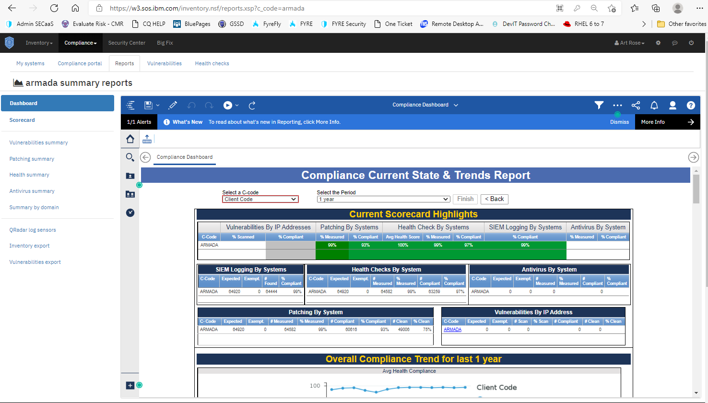
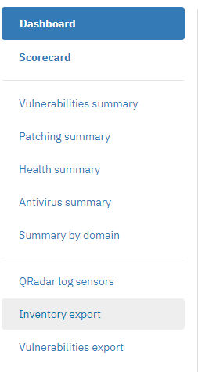
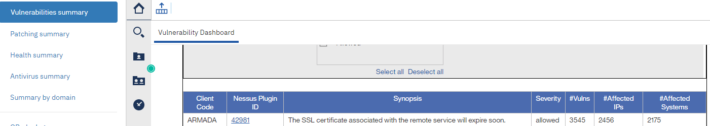
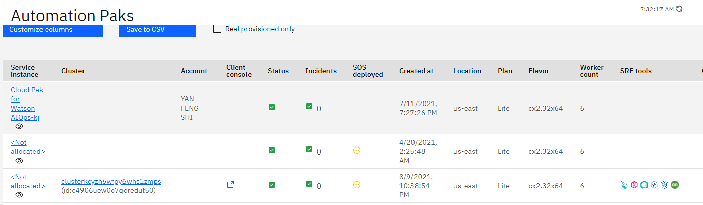
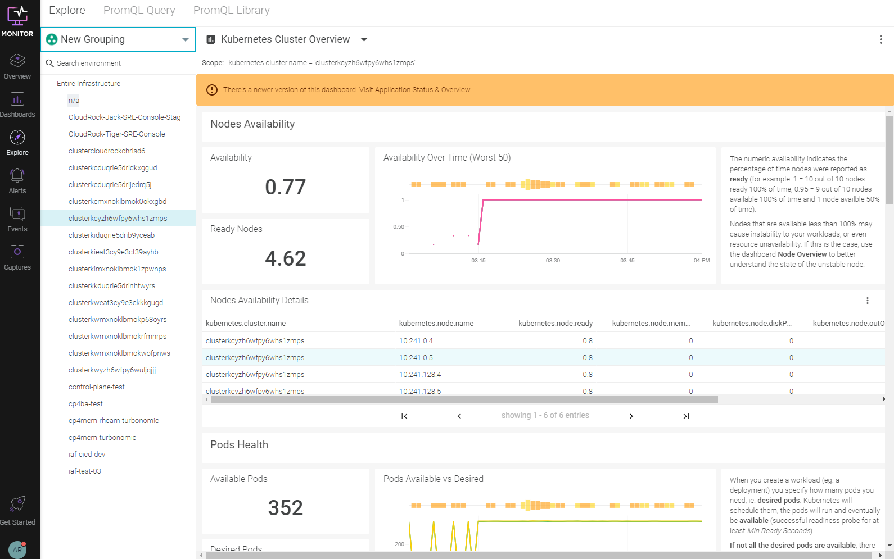
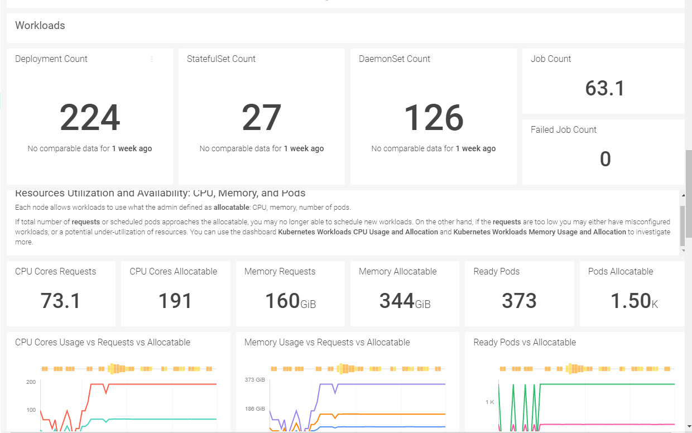
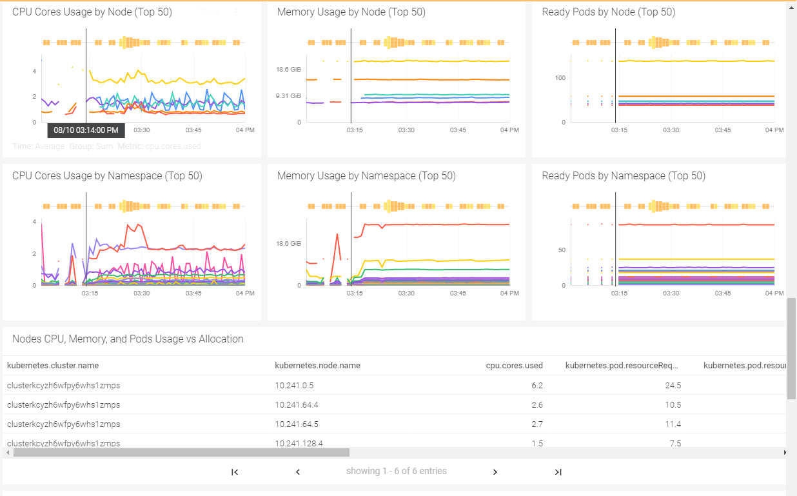
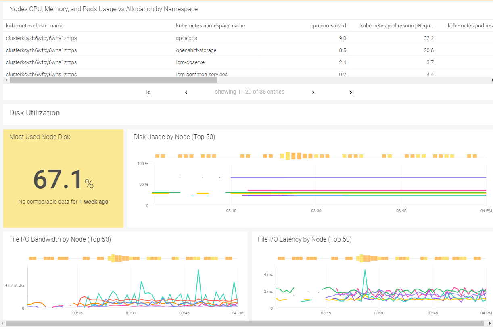
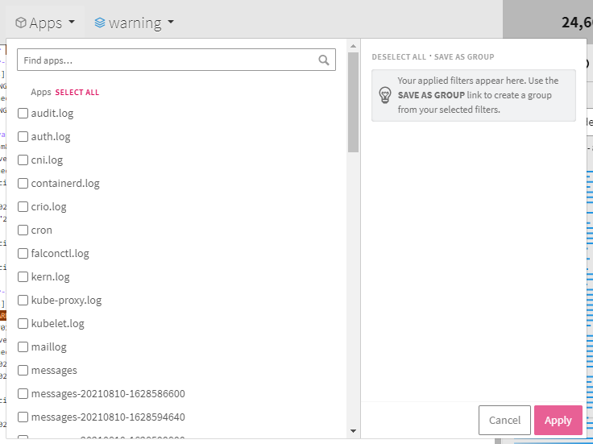
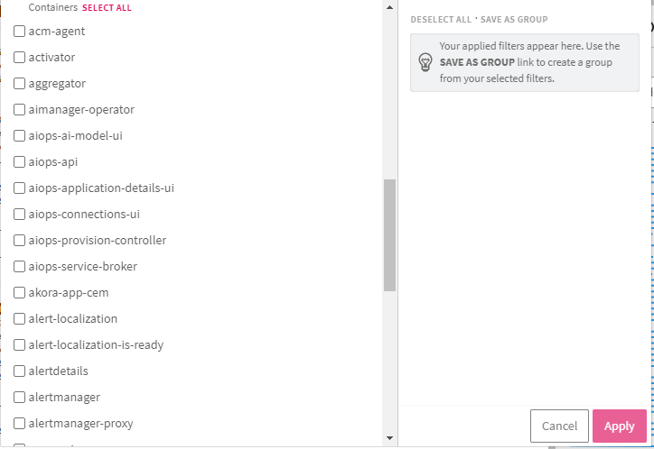

## SOS Logging

SOS Logging is more O.S. patch or release related.
SOS Logging is at https://w3.sos.ibm.com/inventory.nsf/reports.xsp?c_code=armada
You need to have an SOS Cognos AD userid, which you can get on Access Hub.  But there are all sorts of links to look at on there once you are logged in:

It looks like you can do things like click on Vulnerabilities summary, and then click one of the Nessus Plugin ID’s, and it will open a different window with more detail, including all the hosts/nodes with the vulnerability.

Additionally, you can glean health check or patch information per cluster at https://w3.sos.ibm.com/inventory.nsf/my_systems.xsp

## SRE Console
For other tools, there are ways to look at logs from the SRE Console point of view.  Go to:
https://sre-console.automation.cloud.ibm.com/sre-console/login
after a re-direct to:   https://sre-console.automation.cloud.ibm.com/sre-console/katamaris
Under the SRE Tools section, there are link icons to more reporting tools.

The first icon is for sysdig, aka IBM Cloud Monitoring (light blue).  It gives a report on availability and health of the pods in the cluster.  

The next is lognda (red icon).  Looking at the details after clicking it, it appears to log events from tons of sources.   Click on Apps, and you will see the list.   They are separated into ‘Apps’ logs and ‘Containers’ logs.  
You can choose to look at certain logs, or all logs.  
This appears to be where you will see most info you want like system logs or specific app logs like calico.

## Apps

## Containers
