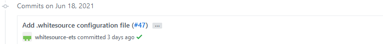
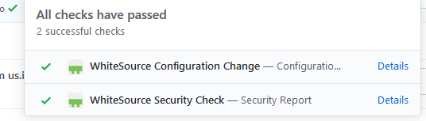
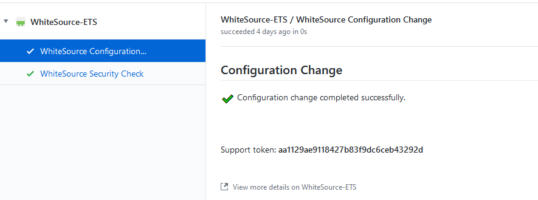
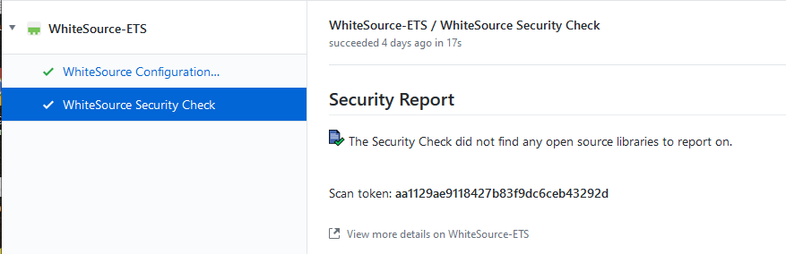

**WhiteSource Scanning for GitHub**
To setup the WhiteSource scanner for GitHub, start with the page:
https://pages.github.ibm.com/Whitesource-IBM/whitesource/

Submit the onboarding request as outlined on the Getting Started page.  Once approved, follow the next steps outlined here to install WhiteSource (https://pages.github.ibm.com/Whitesource-IBM/whitesource/docs/WhiteSource%20-%20GitHub%20Enterprise%20App%20installation/)

Click on the following url:   https://github.ibm.com/github-apps/whitesource-ets/
Click on the Configure button
On the following page, choose automation-saas
On the following page, choose all repositories and click the request button

That will generate a request to the various owners of the GitHub Repo.  Once an owner approves the installation request, that should merge it into the Default branch level of the repo, and trigger a scan.  If there are other repo’s that your repo depends on, they will get automatic requests for installation by default.  For example, under automation-saas, CICD depends on CICD-Core and CICD-scripts, so those 2 also had requests generated for them with the base request I did for CICD.

The scan itself seems to take very little time to process.  You need to go to the commits section on github.ibm.com for the appropriate repo.  For the 3 I did here, it was:
https://github.ibm.com/automation-saas/CICD/commits/main/
https://github.ibm.com/automation-saas/CICD-scripts/commits/main/
https://github.ibm.com/automation-saas/CICD-core/commits/main/

On each page, there will be a Commit for “Add .whitesource configuration file”.  For instance:

If you check fast enough, you will see a yellow dot which indicates the scan is currently running.  Above is a green check, which means the scan has already finished processing.
It’s not apparent, but if you left click the green check mark, you can see the scans (2):

You can click the Details to see a little more information.  But it doesn’t give a full listing type of report, just whether the scans passed.

For example:

There is no dashboard we can access to look further, but there is a Slack channel, sos-whitesource

A good reference for the WhiteSource app is at: https://whitesource.atlassian.net/wiki/spaces/WD/pages/697696422/WhiteSource+for+GitHub.com
